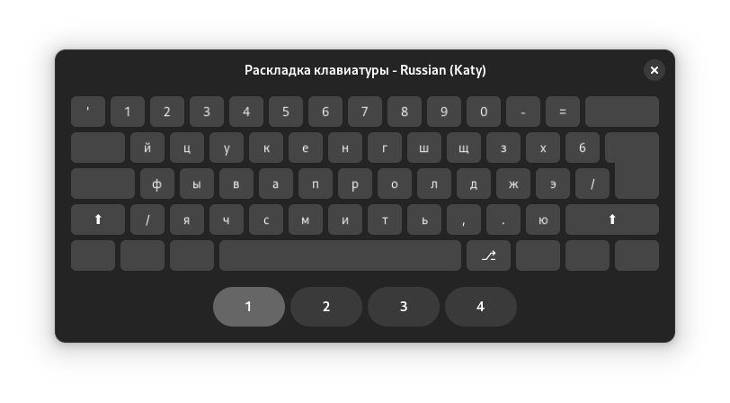
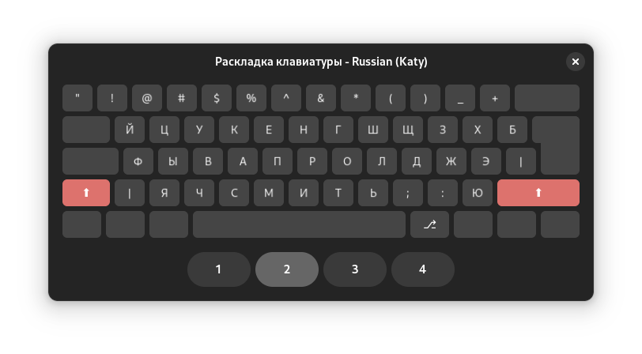
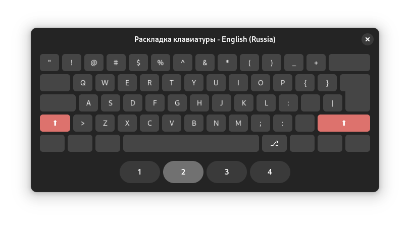
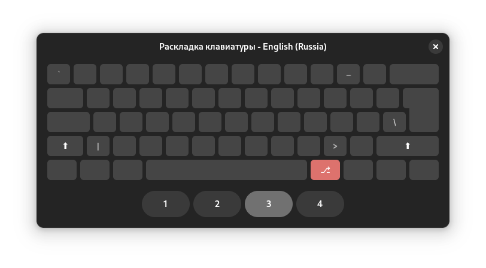

# Cool katy's layout

## Preview

### Russian





### English





## Installation

With `Makefile`:

```bash
sudo make install
```

## Development

To preview layout use:

```bash
tecla "katy(ru)"
tecla "katy(en)"
```
